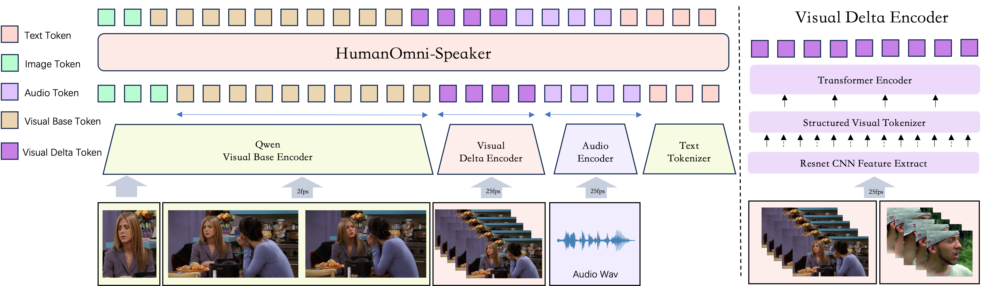

<div align="center">

# HumanOmni-Speaker: Identifying Who said What and When (ECCV 2026)

<a href="https://github.com/HumanMLLM/HumanOmni-Speaker"></a>
<a href="https://arxiv.org/pdf/2603.21664"></a>
<a href="https://huggingface.co/detao/HumanOmniSpeaker"></a>


🎉 **HumanOmni-Speaker has been accepted to ECCV 2026!**

</div>

---

## ✨ Introduction

While Omni-modal LLMs have made strides in joint sensory processing, they still struggle with a cornerstone of human interaction: deciphering complex, multi-person conversations to answer **"Who said what and when"**. Existing models suffer from an *"illusion of competence"* — they exploit visual biases in conventional benchmarks (close-ups, visible microphones, single-person compositions) to bypass genuine cross-modal alignment, while relying on sparse 1-2 fps visual sampling that destroys crucial high-frequency dynamics such as lip movements.

To address this, we introduce:

- 🎯 **VR-SDR (Visual-Registered Speaker Diarization and Recognition)** — given only natural-language visual identity descriptions, the model must output structured records of *identity + timestamps + transcription*. Visual shortcuts are strictly eliminated.
- 📊 **HumanOmni-Speaker Benchmark** — the holistic VR-SDR task plus four atomic diagnostic subtasks (SR / SV / SL / SI), with manually curated Easy/Hard splits for all visually dependent tasks.
- ⚡ **Visual Delta Encoder** — samples raw video at **25 fps** and compresses inter-frame motion residuals into just **6 structured tokens per frame**, capturing fine-grained visemes and speaker trajectories without triggering a token explosion.

HumanOmni-Speaker is the **first Omni model capable of end-to-end lip-reading and high-precision speaker localization directly from raw video**, without intrusive face alignment or lip-cropping preprocessing.

## 🏗️ Model Architecture

HumanOmni-Speaker extends Qwen2.5-Omni with a **dual-stream visual path**:

| Stream | Frame Rate | Role |
|---|---|---|
| **Visual Base Encoder** (shared with Qwen2.5-Omni) | 1-2 fps | Stable identity features & environmental context |
| **Visual Delta Encoder** (ours) | **25 fps** | Inter-frame motion residuals: visemes & speaker trajectories |

The **Visual Delta Encoder** follows a three-stage design:

1. **Local Feature Perception** — a lightweight ResNet-18 frontend balances efficiency with local motion capture at 25 fps;
2. **Structured Visual Tokenizer (SVT)** — 7×7 spatial patchification plus large-receptive-field (k=63) spatio-temporal positional convolutions compress dense CNN features into only 6 structured tokens per frame;
3. **Global Context Encoding** — a Transformer encoder integrates the discrete temporal increments across frames into coherent behavioral semantics.

The Audio Encoder and Text Tokenizer are inherited from Qwen2.5-Omni; all modality tokens are aligned into the shared LLM decoder.

<div align="center">

</div>

## 🚀 Quickstart

### 1. Environment

```bash
conda create -n humanomni python=3.10 -y
conda activate humanomni
pip install -r req.txt    # torch 2.5.1+cu121, transformers 4.57.6, fairseq 0.12.2, ...
```

### 2. Download Model & Benchmark from HuggingFace

The model weights and benchmark data are hosted on HuggingFace — download them into the repo root:

```bash
pip install -U "huggingface_hub[cli]"

# Model weights + tokenizer/config -> HumanOmniSpeaker/
huggingface-cli download detao/HumanOmniSpeaker --local-dir HumanOmniSpeaker

# Benchmark annotations + videos -> benchmark/   (TODO: link)
```

`HumanOmniSpeaker/` contains the Qwen2.5-Omni style config/tokenizer, `delta_encoder.pt` (Visual Delta Encoder weights) and `llm_weights.pt` (Thinker backbone weights). `benchmark/` contains the evaluation annotations (`anno/*.jsonl`) and videos (`data/`).

### 3. Inference

> Annotation files reference videos via relative paths (e.g. `data/SI-easy/xxx.mp4`), so run from the `benchmark/` directory.

```bash
cd benchmark
CUDA_VISIBLE_DEVICES=0 python ../infer.py \
    --dataset anno/SI-easy.jsonl \
    --out ../results/si_easy.jsonl
```

Key flags of `infer.py`:

| Flag | Meaning | Default |
|---|---|---|
| `--use-delta-token / --no-use-delta-token` | Visual Delta Encoder tokens (fill audio placeholders) | on |
| `--use-vb-token / --no-use-vb-token` | Visual Base Encoder (ViT) tokens | off |
| `--use-audio-token / --no-use-audio-token` | Whisper audio tokens | off |
| `--max-samples` | Max samples to infer (0 = all) | 0 |
| `--timeout` | Per-sample generation timeout (seconds) | 20 |

For the benchmark tasks in the paper, use all three tokens (`--use-delta-token --use-vb-token --use-audio-token`); see the ready-made scripts in `benchmark/scripts/`, including an 8-GPU distributed runner.

### 4. Evaluation

Inference writes `{"video_name", "pred", "gt"}` jsonl files; metrics are computed separately:

```bash
python eval.py results/si_easy.jsonl -t si
# tasks: asr / vsr / avsr / si / sl / sv / vrsdr
```

Task presets: LRS tasks (asr / vsr / avsr) report **WER**; SI and SV report **accuracy + error rate**; SL reports **hit rate / miss rate** (IoU > 0.2); VR-SDR reports Identity-Fixed **SA-WER** (*who said what*) + **IER** (*who said when*).

## 📈 Evaluation

### HumanOmni-Speaker Benchmark (Main Results)

| Method | Size | SR ↓ | SV ↓ | SL ↓ | SI-easy ↓ | SI-hard ↓ | Atomic AVG ↓ | VR-SDR What (SA-WER) ↓ | VR-SDR When (IER) ↓ | Holistic AVG ↓ |
|---|---|---|---|---|---|---|---|---|---|---|
| *Closed-source Omni Models* | | | | | | | | | | |
| Gemini3-Pro | - | 1.39 | **5.2** | 12.8 | 5.5 | 30.5 | 11.1 | **36.6** | 36.3 | **36.5** |
| Qwen3-Omni-flash | - | **1.22** | 43.9 | 2.8 | 3.6 | 43.5 | 19.0 | 82.9 | 47.2 | 65.0 |
| *Open-source Omni Models* | | | | | | | | | | |
| OLA | 7B | 1.9 | 51.1 | 20.6 | 12.4 | 63.2 | 29.8 | 95.4 | 56.85 | 76.1 |
| VITA1.5 | 7B | 3.4 | 51.4 | 20.2 | 10.3 | 56.6 | 28.4 | 93.6 | 54.40 | 74 |
| Qwen2.5-Omni | 3B | 2.2 | 44.2 | 7.4 | 6.6 | 51.5 | 22.4 | 84.6 | 50.9 | 67.8 |
| Qwen2.5-Omni | 7B | 1.8 | 37.1 | 7.4 | 4.0 | 54.5 | 20.9 | 83.6 | 49.4 | 66.5 |
| *HumanOmni-Speaker Models* | | | | | | | | | | |
| Qwen2.5-Omni-SFT | 3B | 2.0 | 13.4 | 3.0 | 1.7 | 33.2 | 10.7 | 52.1 | 31.5 | 41.8 |
| **HumanOmni-Speaker** | 3B | 1.9 | 13.2 | **0.8** | **1.0** | **21.1** | **7.6** | 47.1 | **28.5** | 37.8 |

**Highlights**

- 🎯 **Speaker Localization 0.8% / SI-easy 1.0%** — the 25 fps dual-rate architecture captures the high-frequency dynamics needed for precise speaker tracking, far ahead of Qwen3-Omni (2.8%) and Gemini3-Pro (12.8%).
- 🔍 **SI-Hard 21.1%** — with visual shortcuts removed, every baseline degrades catastrophically; HumanOmni-Speaker remains the clear best.
- 🧩 **Visual Delta Encoder matters** — vs. the SFT baseline without it: SL 3.0→0.8, SI-Hard 33.2→21.1, SA-WER 52.1→47.1, IER 31.5→28.5.

### VSR / AVSR on LRS2 & LRS3 (raw video, no preprocessing)

| Method | Preprocessing | LRS2 *vsr\|asr\|avsr* | LRS3 *vsr\|asr\|avsr* |
|---|---|---|---|
| *Specific VSR Models* | | | |
| CTC/Attention | Lip crop & align | 63.5\|-\|7.0 | - |
| AV-HuBERT Base | Lip crop & align | 31.2\|-\|- | 34.8\|-\|- |
| AutoAVSR | Lip crop & align | 27.9\|-\|1.5 | 33.0\|-\|0.9 |
| *LLM-based AVSR Models* | | | |
| Llama-SMoP | Lip crop & align | - | -\|-\|0.96 |
| Llama-AVSR | Lip crop & align | - | 24.0\|0.79\|0.77 |
| Whisper-flamingo | Lip crop & align | -\|-\|1.4 | -\|-\|0.76 |
| *Omni Models* | | | |
| OLA | Raw video | -\|5.5\|- | -\|4.7\|- |
| Qwen2.5-Omni | Raw video | -\|3.47\|- | -\|3.63\|- |
| **HumanOmni-Speaker** | Raw video | 29.8\|3.47\|**1.36** | 33.4\|3.63\|**0.76** |

**Highlights**

- 👄 **First Omni model with native end-to-end lip-reading** — no face alignment, no lip ROI cropping; VSR on par with AutoAVSR while AVSR beats all LLM-based methods.
- 🔗 **Vision bridges the modalities** — adding visual input drops WER from 3.63% → 0.76% on LRS3 and 3.47% → 1.36% on LRS2.

## 📖 Citation

If you find HumanOmni-Speaker useful, please cite our paper:

```bibtex
@inproceedings{bai2026humanomnispeaker,
  title={HumanOmni-Speaker: Identifying Who said What and When},
  author={Bai, Detao and Wei, Xihan and Ma, Zhiheng},
  booktitle={European Conference on Computer Vision (ECCV)},
  year={2026}
}
```
